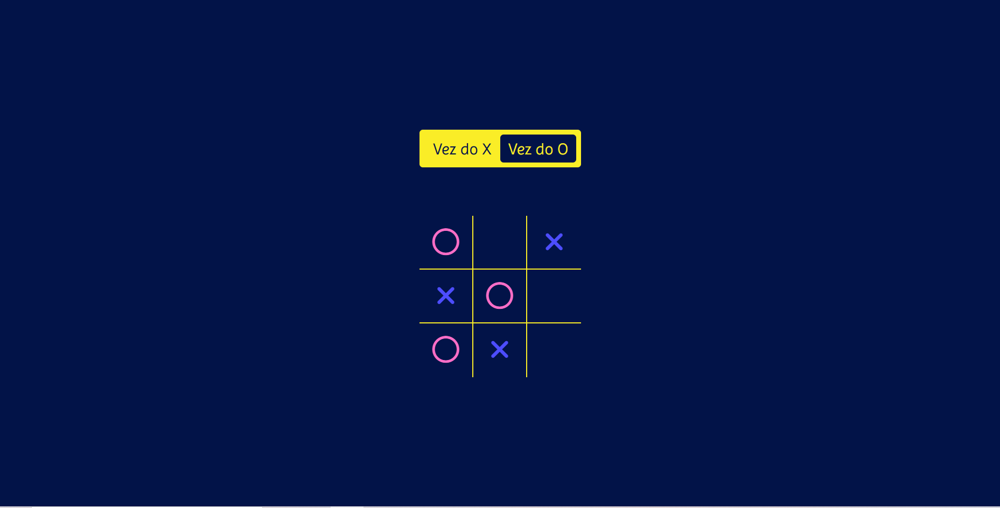

# Tic-tac-toe (Jogo da Velha)

---

## Sobre

Tic-tac-toe ou Jogo da Velha é um jogo para dois jogadores que devem revezar turnos marcando X ou O num espaço  3 x 3 de linhas e colunas. 
Ganha quem conseguir completar verticalmente, horizontalmente e diagonalmente seu símbolo escolhido ( X/O). 

---

## Tecnologias Utilizadas

- HTML
- CSS
- JS
- Responsividade
- Markdown

## Autor 

- [Bianca Leão](https://github.com/leaobia)